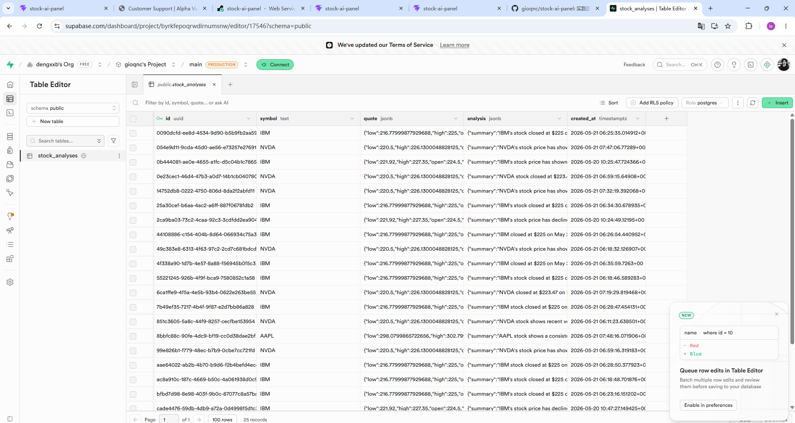

# AI 股票分析面板（精简版）

一个全栈股票分析演示应用：用户输入股票代码，后端调用免费行情 API 获取数据，再调用 LLM 输出严格 JSON 分析结果，并把记录保存到 Supabase。

> 免责声明：本项目仅用于技术演示，不构成任何投资建议。

## 在线访问

Render URL：https://stock-ai-panel-wury.onrender.com/

## 功能

- 输入股票代码获取最近日线行情
- 展示最新收盘价、涨跌幅、成交量、最高价、最低价
- 用折线图展示近期收盘价趋势
- 调用 LLM 返回严格 JSON：
  - `summary`
  - `sentiment`: `Bullish | Neutral | Bearish`
  - `risk_level`: `Low | Medium | High`
- 将行情快照和 AI 分析结果保存到 Supabase
- 读取最近 20 条历史分析记录

## 技术栈

- React + TypeScript + Vite
- Express
- Yahoo Finance chart endpoint + optional Stooq CSV + Alpha Vantage fallback
- OpenAI-compatible Chat Completions API
- Supabase Postgres
- Render

行情源说明：项目优先使用 Yahoo Finance 免 key 行情接口，避免 Alpha Vantage 免费额度过低导致频繁限流；如果配置了 `STOOQ_API_KEY` 会优先尝试 Stooq，Alpha Vantage 作为备用行情源。

## 本地运行

```bash
npm install
copy .env.example .env
npm run dev
```

打开：

```text
http://localhost:5173
```

后端 API：

```text
http://localhost:3000/api/health
```

## 环境变量

`.env.example`：

```env
ALPHA_VANTAGE_API_KEY=
STOCK_CACHE_TTL_MINUTES=720
STOOQ_API_KEY=
LLM_API_KEY=
LLM_BASE_URL=https://api.openai.com/v1
LLM_MODEL=gpt-4o-mini
SUPABASE_URL=
SUPABASE_SERVICE_ROLE_KEY=
CLIENT_ORIGIN=http://localhost:5173
PORT=3000
```

说明：

- `ALPHA_VANTAGE_API_KEY`：备用行情 API Key；主行情源失败时使用。
- `STOCK_CACHE_TTL_MINUTES`：行情缓存时间，默认 720 分钟。
- `STOOQ_API_KEY`：可选。Stooq CSV 下载 key；不填时使用 Yahoo Finance 免 key 行情源。
- `LLM_API_KEY`：用于调用大模型。
- `LLM_BASE_URL`：兼容 OpenAI Chat Completions 的接口地址。
- `LLM_MODEL`：使用的模型名称。
- `SUPABASE_SERVICE_ROLE_KEY`：只允许放在后端环境变量中，不要暴露给前端。

## Supabase 建表 SQL

在 Supabase SQL Editor 中执行：

```sql
create table if not exists stock_analyses (
  id uuid primary key default gen_random_uuid(),
  symbol text not null,
  quote jsonb not null,
  analysis jsonb not null,
  created_at timestamptz not null default now()
);

create index if not exists idx_stock_analyses_symbol
on stock_analyses(symbol);
```

## Supabase 保存记录截图

下图展示了 `stock_analyses` 表中保存的股票分析记录，包含 `symbol`、`quote`、`analysis`、`created_at` 等字段。



## Prompt 设计

项目后端文件：`server/llm.js`

核心 Prompt：

```text
你是一个股票数据分析助手。

请根据下面的股票行情数据做一个简洁分析。
必须只返回合法 JSON，不要写 Markdown，不要写解释，不要写多余文字。

JSON 必须严格符合这个结构：
{
  "type": "object",
  "required": ["summary", "sentiment", "risk_level"],
  "additionalProperties": false,
  "properties": {
    "summary": { "type": "string" },
    "sentiment": { "type": "string", "enum": ["Bullish", "Neutral", "Bearish"] },
    "risk_level": { "type": "string", "enum": ["Low", "Medium", "High"] }
  }
}

规则：
- summary 用中文写，1 到 3 句话，直接说明最近走势和原因。
- sentiment 只能是：Bullish、Neutral、Bearish。
- risk_level 只能是：Low、Medium、High。
- 不要给投资建议，只做技术演示分析。
- 只能基于我提供的数据分析，不要编造其他信息。

股票数据：
{{stock_data_json}}
```

后端还使用 `zod` 做二次校验：

```js
export const AnalysisSchema = z.object({
  summary: z.string().min(8),
  sentiment: z.enum(["Bullish", "Neutral", "Bearish"]),
  risk_level: z.enum(["Low", "Medium", "High"]),
});
```

## API

| 方法 | 路径 | 说明 |
|---|---|---|
| `GET` | `/api/health` | 查看环境变量配置状态 |
| `GET` | `/api/stock/:symbol` | 获取股票行情 |
| `POST` | `/api/stock-analysis` | 获取行情、调用 LLM、保存 Supabase |
| `POST` | `/api/analyze` | 兼容旧版本的分析接口 |
| `GET` | `/api/analyses` | 获取历史分析记录 |
| `GET` | `/api/prompt-template` | 查看 Prompt 模板 |

`POST /api/stock-analysis` 请求体：

```json
{
  "symbol": "IBM"
}
```

## Render 部署

1. 将代码提交到 GitHub。
2. 在 Render 新建 Web Service。
3. 连接 GitHub 仓库。
4. Build Command：

```bash
npm install && npm run build
```

5. Start Command：

```bash
npm start
```

6. Environment Variables 填入：

```text
ALPHA_VANTAGE_API_KEY
LLM_API_KEY
LLM_BASE_URL
LLM_MODEL
SUPABASE_URL
SUPABASE_SERVICE_ROLE_KEY
CLIENT_ORIGIN
PORT
```

部署到 Render 后，建议把 `CLIENT_ORIGIN` 改成你的 Render 域名。

## Debug 记录

### 问题：线上点击 AI 分析并保存时显示 Failed to fetch

现象：

部署到 Render 后，打开线上地址：

```text
https://stock-ai-panel-wury.onrender.com/
```

输入 `NVDA` 后点击 `AI 分析并保存`，页面左侧提示：

```text
Failed to fetch
```

真实排查过程：

1. 先看 Supabase 的 `stock_analyses` 表，发现有些分析记录已经写入，说明 Supabase 连接和保存逻辑不是主要问题。
2. 再用浏览器复现线上页面操作，点击 `AI 分析并保存` 后仍然显示 `Failed to fetch`，但页面历史记录可以正常读取。
3. 用接口直接请求后端，确认 `/api/stock/:symbol`、`/api/analyses` 和后端保存逻辑可以正常工作。
4. 检查 Render 环境变量和 CORS 配置，发现 `CLIENT_ORIGIN` 曾经带了末尾 `/`，先在后端做了归一化处理：

```js
const clientOrigin = (process.env.CLIENT_ORIGIN || "http://localhost:5173").replace(/\/+$/, "");
```

5. 继续在浏览器里点按钮测试，发现 `POST /api/analyze` 这个路径仍然容易触发浏览器环境里的 `Failed to fetch`。为了避免路径被误拦截，我把分析接口改成更明确的业务路径 `/api/stock-analysis`。

实际修改：

后端把分析逻辑抽成同一个处理函数，并同时支持新旧两个接口：

```js
async function handleStockAnalysis(req, res, next) {
  try {
    const symbol = validateSymbol(req.body?.symbol);
    const quote = await fetchStockData(symbol);
    const analysis = await analyzeStock(quote);
    const saved = await saveAnalysis({ symbol, quote, analysis });

    res.json({
      symbol,
      quote,
      analysis,
      persisted: saved.persisted,
      id: saved.id,
      warning: saved.persisted ? null : "Supabase 未配置，本次结果未写入数据库",
    });
  } catch (error) {
    next(error);
  }
}

app.post("/api/stock-analysis", handleStockAnalysis);
app.post("/api/analyze", handleStockAnalysis);
```

前端请求从旧接口：

```ts
await apiRequest<AnalyzeResponse>('/api/analyze', ...)
```

改成：

```ts
await apiRequest<AnalyzeResponse>('/api/stock-analysis', ...)
```

同时我还加了一个兜底逻辑：如果浏览器没有拿到分析接口响应，但后端已经写入成功，就从 `/api/analyses` 重新读取最近的历史记录并展示。

最终结果：

重新提交 GitHub 并让 Render 自动部署后，再次打开线上页面测试。输入 `NVDA` 点击 `AI 分析并保存`，页面可以正常展示行情卡片、AI JSON 分析结果和历史记录，Supabase 的 `stock_analyses` 表里也能看到新增记录。

## 参考链接

- Alpha Vantage API 文档：https://www.alphavantage.co/documentation/
- Supabase JavaScript 文档：https://supabase.com/docs/reference/javascript/insert
- Render Node Express 部署文档：https://render.com/docs/deploy-node-express-app
- OpenAI Structured Outputs 文档：https://platform.openai.com/docs/guides/structured-outputs
